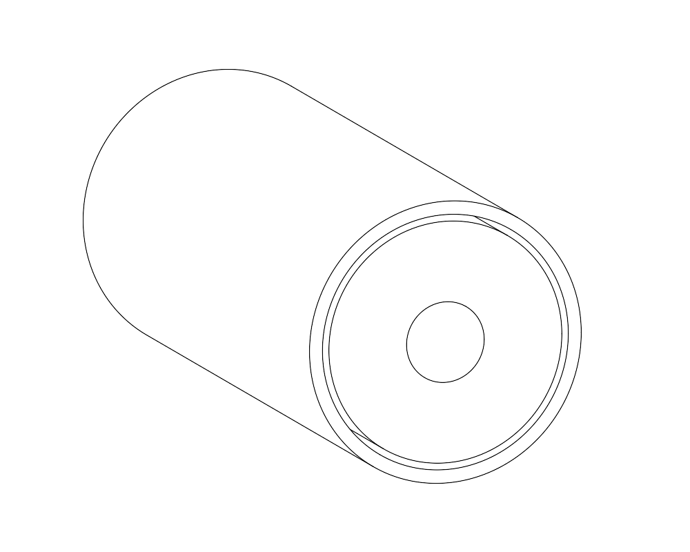

# Current design
Parameter | Value | Units |
|---|---|---|
| blanket offset from source | 10 | m |
| blanket thickness | 10 | m |
| vessel offset from blanket |10 | m |
| blanket material | 10 | |
| blanket Li6 enrichment | 10 | percent |

# Model checks
| Check | Requirement | Current design value | Status |
|---|---|---|---|
| Weight of vacuum vessel | < 1000kg | 1000000000000.0 ||
| Radius of vessel | < 10m | 10000000.0 | 
# Neutronics checks
| Check | Requirement | Current design value | Status |
|---|---|---|---|
| Tritium breeding Ratio | > 1.1 | @TBR |  |
| Heating of the blanket | > 1GJ | @BlanketHeating | |

