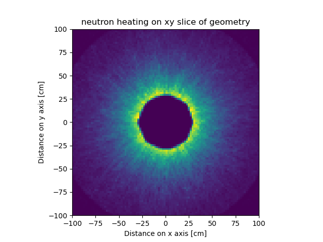

# Design Parameters
- blanket material: string
- blanket Li6 enrichment: float between 0. and 100.
- vessel offset from blanket: float above 0.
- blanket thickness: float above 0.
- blanket offset from source: float above 0.

# Current design
Parameter | Value | Units |
|---|---|---|
| blanket offset from source | 30 | m |
| blanket thickness | 60 | m |
| vessel offset from blanket |5 | m |
| blanket material | Lithium | |
| blanket Li6 enrichment | 10 | percent |

# Model checks
| Check | Requirement | Current design value | Status |
|---|---|---|---|
| Weight of vacuum vessel | lt 30000000.0kg | 24190263.43264143 ||
| Radius of vessel | lt 200m | 105 | 
# Neutronics checks
| Check | Requirement | Current design value | Status |
|---|---|---|---|
| Tritium breeding Ratio | ge 1.1 | 1.3059808923280056 |  |
| Tritium breeding Ratio | lt 3 | 1.3059808923280056 |  |

