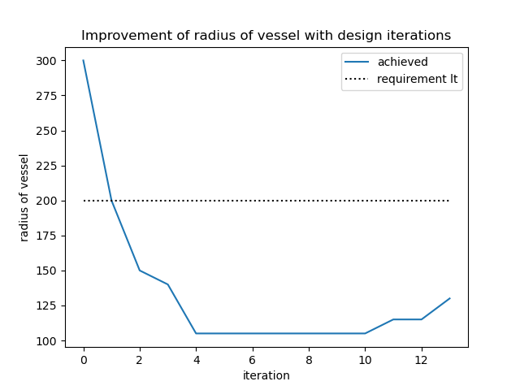
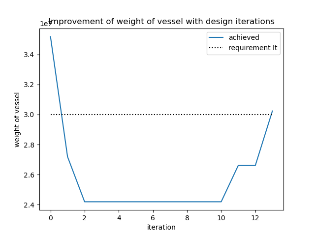

# Design Parameters
- blanket material: string
- blanket Li6 enrichment: float gt 0. and lt 100.
- vessel offset from blanket: float gt 0.
- blanket thickness: float gt 0.
- blanket offset from source: float gt 0.

# Current design
Parameter | Value | Units |
|---|---|---|
| blanket offset from source | 30 | m |
| blanket thickness | 500 | m |
| vessel offset from blanket |5 | m |
| blanket material | Lithium | |
| blanket Li6 enrichment | 15 | percent |

# Model checks
| Check | Requirement | Current design value | Status |
|---|---|---|---|
| Weight of vacuum vessel | lt 30000000.0kg | 130627422.53626253 |  |
| Radius of vessel | lt 200m | 545 |  
# Neutronics checks
| Check | Requirement | Current design value | Status |
|---|---|---|---|
| Tritium breeding Ratio | ge 1.1 | 1.7376296146563341 |  |
| Tritium breeding Ratio | lt 3 | 1.7376296146563341 |  |

# Improvement tracking

